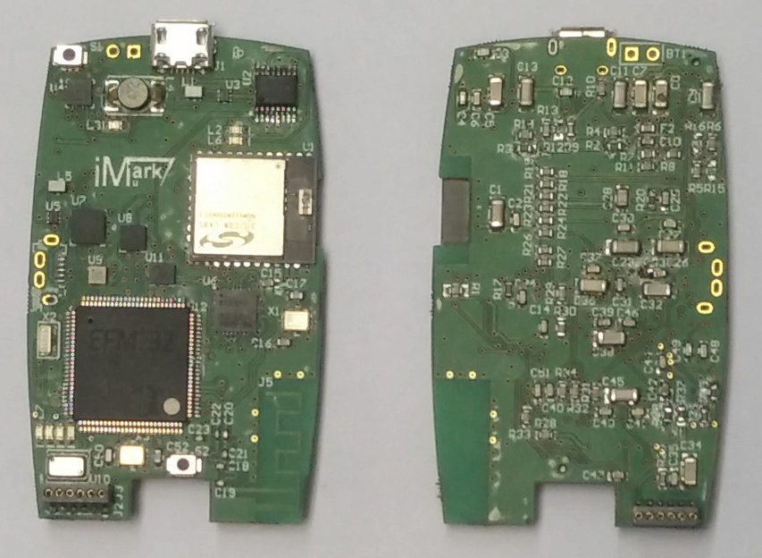
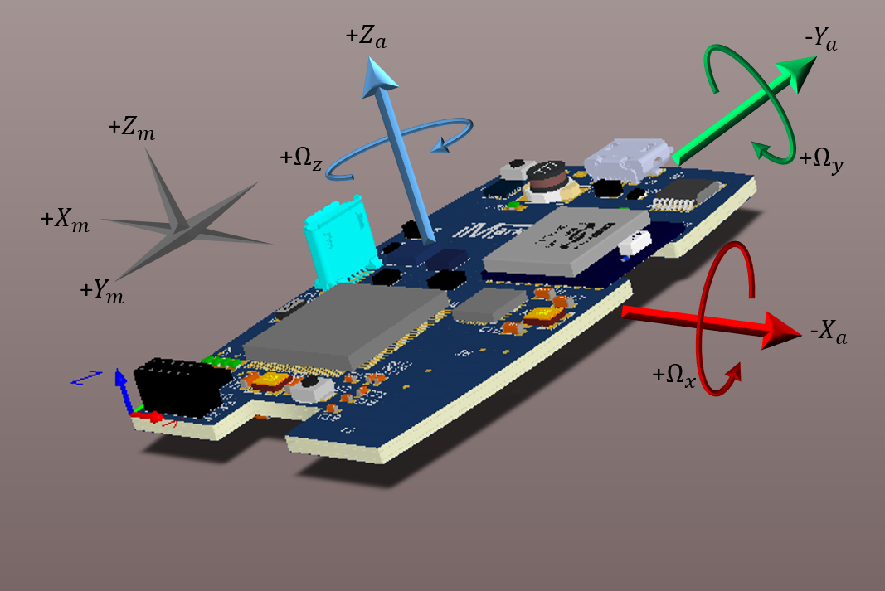
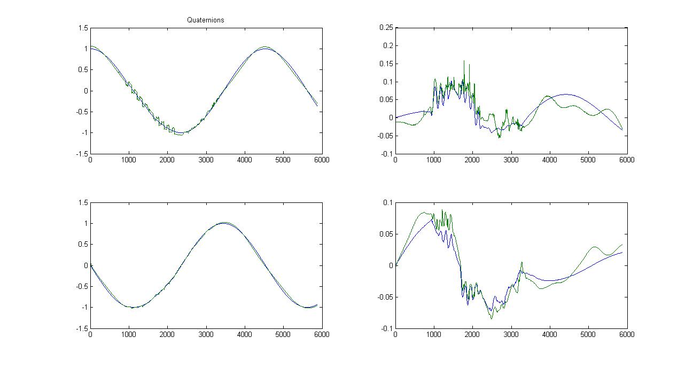
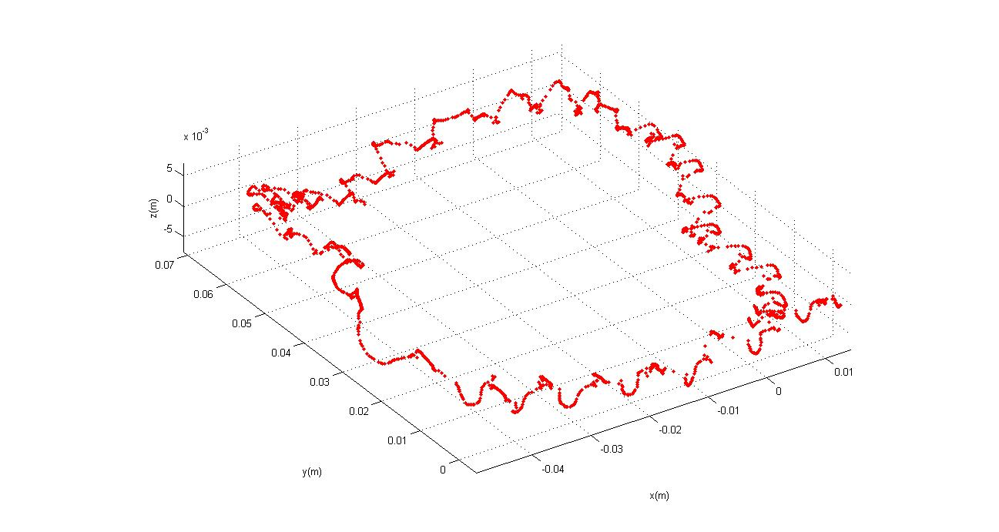

# IMU-Mark
## Overview
The IMU-MARK is a inertial measure unit developed to tracking the human movement. It combines 3-axis gyroscope, 3-axis accelerometer and 3 axis magnetometer, also have an iNemo module and pressure sensor. Additionally, each sensor have an SPI dedicated in order to get the data and nearly placed for accurate measurements. 

The module is able to send the data in 3 different ways of communication: Bluetooth, serial and radio.

For precision tracking of both fast and slow motions, the parts feature a user-programmable gyroscope full-scale range, a user-programmable accelerometer full-scale range and a user-programmable magnetometer full-scale range.

All sensors and communication modules are controlled by a powerful 32-bit ARM Cortex-M4 microcontroller, with DSP instruction support and floating-point unit that allows the processing of complex math functions and handling decimal variables.

 

## Application Information

To test the Device two approaches were developed. The first one implements a Kalman filter to get the orientation, and the second one collect the data from the sensors when a control signal is received to tracking the route of a moving person. In both cases the data were processing in MATLAB to analyze the overall performance.
The orientation of each inertial sensor is showed in the figure:

### Kalman Filter Approach

A Kalman filter was implemented in order to get the quaternion based in the measures of gyroscope, accelerometer and magnetometer. Then, the data acquired is processing in MATLAB to convert the quaternion in Cartesian coordinates. The figure shows the expected Results (line Blue) compared with experimental Results (line Green). The expected results were calculated using just the gyroscope measure whereas the experimental results were calculated with the quaternion evaluated in the microcontroller.

The Kalman filter algorithm was developed taking into account the sample time and  some parts of the necessary math were pre-calculated, because that, the error between the experimental and the expected result is mainly caused by a delay of the sampling time produced by the conversion of floating point data in ASCII before be send.  

Quaternion dimensions. Expected Results (line Blue) vs experimental Results (line Green).

### Tracking Movement Approach

Is possible to approximate the position of a movement body by knowing its acceleration. However, the noise in the measures and the existence of bias could be hard to handle in the algorithm based in the observation of the accelerometer. With the open source algorithm developed by  XIO-Tecnologies to track the movement that take into account the accelerometer, gyroscope and magnetometer measures the IMU-MARK was tested. The data are collected in a fixed step time controlled by a control signal from the computer then, all data are processing in MATLAB.

The figure shows the tracking of a square trajectory. To take the measure, the device was placed in a person foot, that is the reason of the irregularity of the trace. Notice that the scale is in meters, and a single step is 0.03 meters average, then the precision of the measure is not reliable but the general shape of the trajectory is similar to the path followed.

## Conclusions

* The device is functional, and can take measures through all installed sensors. 
* The information received from the device is reliable, but some imprecision were caused in the application algorithm in the data processing.
* The results show that the device is able to perform complex algorithms like Kalman filter.
* The wireless communication cannot be tested due to the lack of time.
